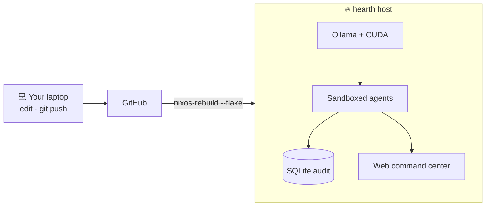
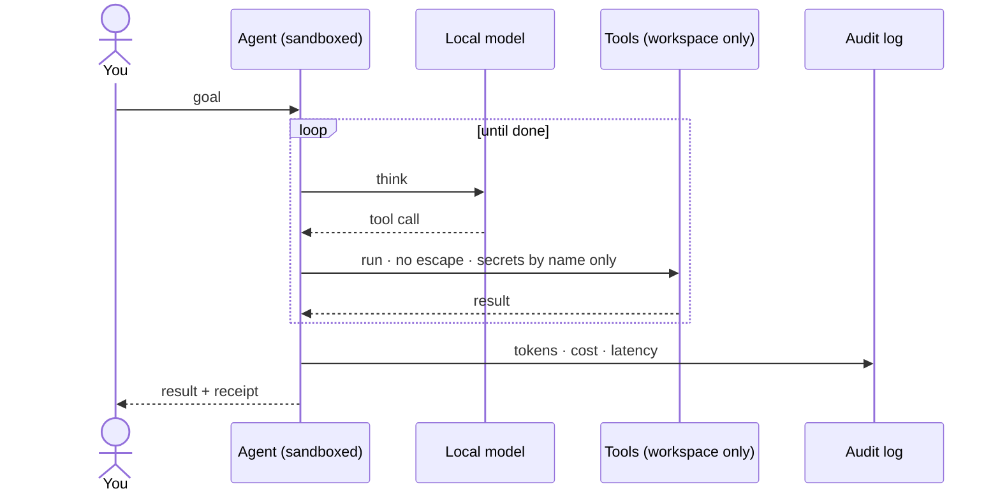

<div align="center">



<br/>
<br/>

[](https://github.com/EricFinland/hearth/actions/workflows/build.yml)


[](https://github.com/EricFinland/hearth/releases)

### Local LLMs and autonomous agents, sandboxed by default. Every run audited. The whole OS reproducible from one flake.

[**📖 Documentation**](https://ericfinland.github.io/hearth/) &nbsp;·&nbsp; [**🚀 Quickstart**](#quickstart) &nbsp;·&nbsp; [**🧠 Architecture**](https://ericfinland.github.io/hearth/concepts/architecture/)

</div>

---

Most people run local agents with full system privileges and no record of what they did. **hearth flips that.** Agents are contained at the operating-system level, every run records its tokens, cost, latency, and errors to a local database, and the entire system is defined in one `flake.nix` you can rebuild identically and roll back in a single command.

> It is not a custom kernel or a remastered distro. It is a declarative NixOS system you `nixos-rebuild switch` into existence.

> **Status: v1.0, stable.** The whole stack runs on real hardware: sandboxed agents, the audit log, the reproducible flake, the web cockpit, an OpenAI-compatible API, a local knowledge base, a standing-missions scheduler, and the self-improvement loop (which only ever produces reviewable, gated branches, never auto-changing a running system). Local model quality is the honest ceiling. See the [CHANGELOG](CHANGELOG.md).

## What makes it different

|  |  |
| --- | --- |
| 🛡️ **Sandboxed by default** | Agents run as ephemeral, isolated systemd units. No host secrets, no writes outside their own workspace, no privilege escalation. |
| 🧾 **Every run audited** | Tokens, cost, latency, and errors land in local SQLite. One command shows the last 20 runs. A failed run still leaves a trail. |
| ♻️ **Reproducible from boot** | One flake builds the whole OS. Atomic, bootloader-level rollback. Two builds from the same lock are identical. |
| 🧠 **Local and private** | Ollama on your own GPU, agents that actually use tools, a web command center. Zero cloud, nothing leaves the box. |

## Architecture



## See it run

```console
$ hearth-status
● ollama       active (running)   llama3.2:3b, mistral:7b
● tailscale    connected
● recent runs  3 in the last hour

$ hearth-runs
AGENT   MODEL          TOKENS   LATENCY   COST
demo    llama3.2:3b      142     0.9s     $0.00
build   qwen2.5-coder    2.1k    14s      $0.00
chat    mistral:7b       430     3.2s     $0.00
```

## How a run stays contained



## Quickstart

```sh
git clone https://github.com/EricFinland/hearth
cd hearth

nix flake check               # validate the whole system
bash scripts/build-image.sh   # build a bootable image
```

Full install paths (existing NixOS host, fresh VM, or a Linux primer) live in the docs:

### → **[ericfinland.github.io/hearth](https://ericfinland.github.io/hearth/)**

### Use it

```sh
# Point any OpenAI client at your local models (audited):
curl http://your-hearth:8770/v1/chat/completions \
  -d '{"model":"llama3.2:3b","messages":[{"role":"user","content":"hello"}],"stream":true}'

# Check the install is healthy:
hearth-doctor

# Watch activity in Grafana, etc:
curl http://your-hearth:8770/metrics
```

<details>
<summary><b>The full feature set</b></summary>

<br/>

- **Declarative NixOS system.** The entire OS is one flake; `nixos-rebuild switch` applies changes atomically.
- **Ollama on boot** with a declarative model manifest pulled on activation, CUDA-accelerated.
- **Tool-using agent loop** (`hearth-loop`): a model gets a goal and tools (run commands, read and write files, HTTP), runs in a per-run workspace, and is audited.
- **Least-privilege sandbox** with a written threat model: `ProtectSystem=strict`, `ProtectHome`, `NoNewPrivileges`, empty capabilities, a syscall filter, and per-run private temp.
- **Per-run audit log** in SQLite, queryable with `hearth-runs`.
- **Web command center:** chat with a local model and launch sandboxed agents from the browser, with permission modes, an approvals queue, and a kill switch.
- **OpenAI-compatible API** (`/v1/chat/completions` with real token streaming, `/v1/models`): any OpenAI client uses your local models, every call audited.
- **Knowledge base (RAG):** ingest docs or a whole repo (`index_dir`), semantic retrieval via local embeddings with lexical fallback, auto-recalled into agent context.
- **Standing missions:** a scheduler that runs missions on a cadence (the works-while-you-sleep layer).
- **Self-improvement loop:** an always-on daemon proposes changes to hearth's own config, validates them with `nix flake check`, compounds and learns, and produces reviewable branches with one-click promote-to-live and an auto-rollback watchdog.
- **Observability:** a Prometheus `/metrics` endpoint, a usage-over-time stats view, and `hearth-doctor` for a one-command health check.
- **Agent credentials by name:** keys are substituted at request time via systemd credentials, so the model never sees the secret value.
- **More agent tools:** grep, multi-file edit, directory tree, web-to-knowledge, and more.
- **Optional KDE Plasma desktop**, a Tailscale mesh with a tight firewall, secrets via sops-nix, and a boot dashboard.

</details>

---

## Contributing & security

Contributions are welcome, see [CONTRIBUTING.md](CONTRIBUTING.md) for the build
and self-test workflow. Found a security issue? Please follow
[SECURITY.md](SECURITY.md) rather than opening a public issue.

> **First-boot note:** the config ships a default console password for the very
> first local login (SSH is key-only). Change it immediately with `passwd`. See
> [SECURITY.md](SECURITY.md).

---

<div align="center">

Built by <a href="https://github.com/EricFinland">Eric Catalano</a> &nbsp;·&nbsp; MIT licensed &nbsp;·&nbsp; <a href="https://ericfinland.github.io/hearth/">Docs</a> &nbsp;·&nbsp; <a href="CONTRIBUTING.md">Contribute</a> &nbsp;·&nbsp; <a href="SECURITY.md">Security</a>

</div>
